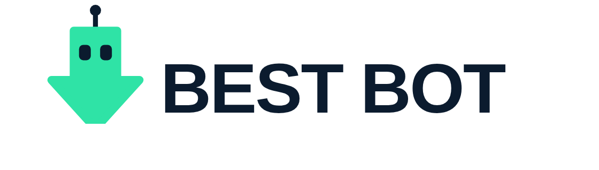
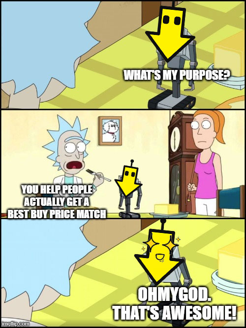

<p align="center">
  
</p>

<p align="center">
  <a href="LICENSE"></a>
  <a href="https://github.com/CR8-OS/best-bot/releases"></a>
  
  <a href="https://github.com/CR8-OS"></a>
</p>

<p align="center">
  <a href="https://ko-fi.com/W7W7H4VS6"></a>
</p>

---

## The policy is real. The friction is the product.

I like Best Buy. I've bought most of my gear there for twenty years, and I like
that they will refund you the difference when a price drops. Their Price Match
Guarantee says so plainly: if they lower their own price during your return and
exchange period, they will match it. Upon request.

The onus being on you is by design.

Nobody emails you when the price drops. You have to know your window started the
day the thing arrived, not the day you ordered it. You have to know whether
yours is 15 days or 60. You have to check the price yourself, repeatedly, for
weeks. You have to confirm the lower price is not a marketplace
seller, a bundle, an open-box unit, or a daily deal, because every one of those
is excluded. Then you have to get on the phone.

None of that is a trick. It is a real policy, honored by real people who will
help you when you call. It is just enough homework that most of us never
collect. A benefit you have to work for is a benefit most people leave on the
table, and everybody involved knows it.

## What happened

I bought a laptop in September. Three days later Best Buy dropped the price on
that exact SKU by $570. I didn't notice, because I wasn't looking, because who
looks.

What noticed was a scheduled AI task I'd pointed at the product page before
closing my laptop for the night. It loaded the page, checked the price against
what I paid, ran the eligibility rules, and pinged my phone with the number and
a script. One phone call later I had $620 back, which was more than the drop,
because the agent found another adjustment while we were on the line.

Total effort on my part: about four minutes.

<p align="center">
  
</p>

## Why I packaged it up

Consumer protections keep getting written as rights you have to actively
exercise, on a deadline, with homework. Price matching, rebates, warranty
claims, fee refunds, the whole genre. The design assumes you have attention to
spare. Most people don't, and the companies modeling breakage rates are counting
on precisely that.

AI happens to be good at the exact thing that friction depends on: showing up
every single day and checking, without getting bored, without forgetting, and
without needing to be reminded that the clock is running.

So this is my small argument for pointing AI at consumers instead of at them.
Same technology that's busy optimizing conversion funnels, aimed the other
direction for once.

## Install

```
/plugin marketplace add CR8-OS/best-bot
/plugin install best-bot@cr8-os
```

## Use

Give it your order details. Upload the confirmation email, paste the receipt
text, or drop in a screenshot:

> Watch this Best Buy order for a price drop.

It confirms what it read off the receipt, works out your window end date, runs a
check immediately, and sets up a recurring watch that stops when your window
does. Then it goes quiet until there's something worth acting on.

To stop it, delete the scheduled task, or just ask.

## What it needs

- **A browser in the session.** Amazon and Walmart block plain page fetches, so
  real price checks need a real browser. If the watch will use the browser on
  your own machine, the scheduled task has to be created with that requirement
  set. It can't be added afterward, and the skill handles this at setup.
- **Scheduled task support** for the recurring watch. Without it you still get a
  one-off check and a straight answer.
- **Automatic approval on the task**, or runs stall waiting for a prompt nobody
  is there to answer.

## What it won't do

On purpose:

- **It won't contact Best Buy.** No chat, no calls, no forms. It writes the
  script, you send it. A refund request should come from the person who made the
  purchase, and there's a human on the other end of that line who deserves to be
  talking to you.
- **It won't buy, return, or cancel anything**, won't sign in to any retailer,
  and won't put anything in a cart. Browsing is read-only and public.
- **It won't report a price it didn't load.** Every number comes from a page it
  opened during that run, with the URL attached. If a check fails it tells you
  the check failed. It does not quietly fall back to a guess, because sending
  you to a call center with a hallucinated price is worse than sending you
  nowhere.
- **It won't keep your payment details.** It takes an order number, dates, a
  SKU, and a price. Card numbers and addresses stay out of its notes, the
  scheduled task, its notifications, and its replies.
- **It won't ping you for nothing.** No news, no notification.

## The thing people get wrong, and it costs money

**The clock starts at delivery, not at purchase.** Best Buy's policy begins the
period the day you receive the product. On anything shipped, that's free extra
window you probably didn't know you had.

Window lengths, for reference:

| | Window |
|---|---|
| No membership | 15 days |
| My Best Buy Plus / Total | 60 days |
| Activatable devices (phones, cellular tablets, hotspots, cellular wearables) | 14 days, everyone |
| Verizon activatable devices | 30 days, everyone |
| Marketplace purchases | Standard 15 days, no member extension, not price-matchable |

More category exceptions exist, along with the full exclusion list and the
restocking fees that make "just return and rebuy it" a bad idea for cameras and
drones. It's all in the skill's reference files.

## Brand and legal

Best Bot is an independent project. It is **not affiliated with, endorsed by, or
sponsored by Best Buy Co., Inc.** "Best Buy," "My Best Buy," and related marks
belong to their owner and are referenced here only to describe what this tool
works with.

The meme in this README is built on frames from Rick and Morty, used as
commentary. Those frames belong to their rights holders, not to this project,
and they are carved out of the MIT license. See LICENSE.

Store policies change without notice. This plugin encodes Best Buy's published
policy as of September 2026, and instructs Claude to trust a live policy page
over its own reference files when the two disagree. Verify anything that matters
before you rely on it.

## Repo layout

```
.claude-plugin/marketplace.json     marketplace definition
plugins/best-bot/
  .claude-plugin/plugin.json        plugin manifest
  skills/best-bot/SKILL.md          the skill
  skills/best-bot/references/       policy rules, checking procedure,
                                    claim scripts, schedule template
  assets/                           logo
```

## If it pays you back

This is free, MIT, and yours to fork. But if Best Bot claws a few hundred
dollars out of the ether for you, and you're feeling flush with your own
recovered money, there's a Ko-fi link below. Tips go straight into building more
of these, because there are a lot of consumer protections out there gathering
dust for exactly the same reason this one was.

If it saved you nothing, you owe me nothing. Seems fair.

<p align="center">
  <a href="https://ko-fi.com/W7W7H4VS6"></a>
</p>

More tools at [github.com/CR8-OS](https://github.com/CR8-OS).

## License

MIT. See [LICENSE](LICENSE).
