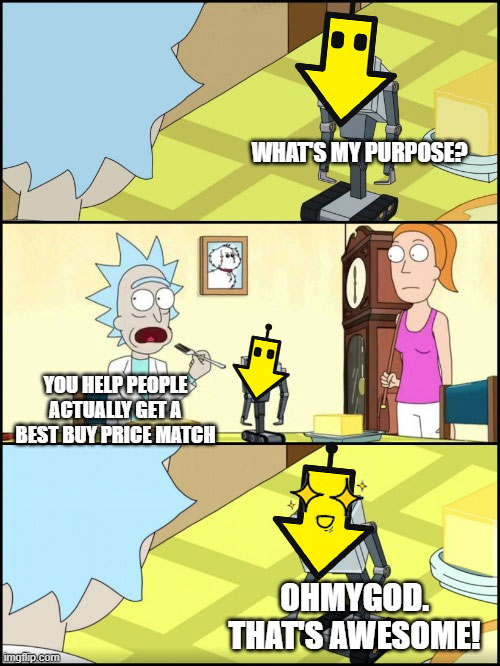

<p align="center">
  
</p>

<p align="center">
  <a href="LICENSE"></a>
  <a href="https://github.com/CR8-OS/best-bot/releases"></a>
  
  <a href="https://github.com/CR8-OS"></a>
</p>

<p align="center">
  <a href="https://ko-fi.com/W7W7H4VS6"></a>
</p>

---

## The policy is legit, but it relies on hassle.

I like Best Buy. Twenty years of buying gear there, and I like that they refund
you the difference when a price drops. Their Price Match Guarantee says it
plainly: if they lower their own price during your return and exchange period,
they'll match it. Upon request.

The onus being on you is by design.

Nobody emails you when the price drops. You have to know your window started the
day the thing arrived, not the day you ordered it. You have to know whether
yours is 15 days or 60. You have to check the price yourself, over and over, for
weeks. You have to rule out marketplace sellers, bundles, open-box units and
daily deals, because every one of those is excluded. Then you have to call.

None of it is a trick. Real policy, real people on the phone who will help you
once you get there. It's just enough homework that most of us never bother, and
breakage has been a line item in retail forecasting since long before anyone
had a word for it.

## What happened

I bought a laptop in September. Three days later Best Buy dropped the price on
that exact SKU by $570. I didn't notice. I wasn't looking. Who looks?

What was looking was a scheduled AI task I'd pointed at the product page the
night before, mostly to find out whether it would work at all. It loaded the
page, checked the price against what I paid, ran the eligibility rules, and
pinged my phone with the number and a script to read. One call later I had $620
back, which is more than the drop, because the agent found another adjustment
while we were on the line. (I did not argue with her.)

Four minutes of my life, total.

<p align="center">
  
</p>

## Why I packaged it up

Here's the pattern I keep running into. Consumer protections get written as
rights you have to actively exercise, on a deadline, with homework. Price
matching, rebates, warranty claims, fee refunds, the whole genre. The design
assumes you have attention to spare. You don't. Nobody does. That part is
already priced in.

I've sat through enough tech cycles to be skeptical of anything sold as
revolutionary. This is not that. It's an agent that shows up every day and
checks a number, which is dull work, and dull work is exactly what friction has
always counted on you skipping.

We've spent a few years pointing this stuff at consumers. I'd like to see more
of it pointed the other way.

## Install

```
/plugin marketplace add CR8-OS/best-bot
/plugin install best-bot@cr8-os
```

## Use

Give it your order details. Upload the confirmation email, paste the receipt
text, or drop in a screenshot:

> Watch this Best Buy order for a price drop.

It confirms what it read off the receipt, works out your window end date, runs a
check immediately, and sets up a recurring watch that stops when your window
does. Then it goes quiet until there's something worth acting on.

To stop it, delete the scheduled task, or just ask.

## What it needs

- **A browser in the session.** Amazon and Walmart block plain page fetches, so
  real price checks need a real browser. If the watch will use the browser on
  your own machine, the scheduled task has to be created with that requirement
  set. It can't be added afterward, and the skill handles this at setup.
- **Scheduled task support** for the recurring watch. Without it you still get a
  one-off check and a straight answer.
- **Automatic approval on the task**, or runs stall waiting for a prompt nobody
  is there to answer.

## What it won't do

On purpose:

- **It won't contact Best Buy.** No chat, no calls, no forms. It writes the
  script, you send it. A refund request should come from the person who made the
  purchase, and there's a human on the other end of that line who deserves to be
  talking to you.
- **It won't buy, return, or cancel anything**, won't sign in to any retailer,
  and won't put anything in a cart. Browsing is read-only and public.
- **It won't report a price it didn't load.** Every number comes from a page it
  opened during that run, with the URL attached. If a check fails it tells you
  the check failed. It does not quietly fall back to a guess, because sending
  you to a call center with a hallucinated price is worse than sending you
  nowhere.
- **It won't keep your payment details.** It takes an order number, dates, a
  SKU, and a price. Card numbers and addresses stay out of its notes, the
  scheduled task, its notifications, and its replies.
- **It won't ping you for nothing.** No news, no notification.

## The thing people get wrong, and it costs money

**The clock starts at delivery, not at purchase.** Best Buy's policy begins the
period the day you receive the product. On anything shipped, that's free extra
window you probably didn't know you had.

Window lengths, for reference:

| | Window |
|---|---|
| No membership | 15 days |
| My Best Buy Plus / Total | 60 days |
| Activatable devices (phones, cellular tablets, hotspots, cellular wearables) | 14 days, everyone |
| Verizon activatable devices | 30 days, everyone |
| Marketplace purchases | Standard 15 days, no member extension, not price-matchable |

More category exceptions exist, along with the full exclusion list and the
restocking fees that make "just return and rebuy it" a bad idea for cameras and
drones. It's all in the skill's reference files.

## Brand and legal

Best Bot is an independent project. It is **not affiliated with, endorsed by, or
sponsored by Best Buy Co., Inc.** "Best Buy," "My Best Buy," and related marks
belong to their owner and are referenced here only to describe what this tool
works with.

The meme in this README is built on frames from Rick and Morty, used as
commentary. Those frames belong to their rights holders, not to this project,
and they are carved out of the MIT license. See LICENSE.

Store policies change without notice. This plugin encodes Best Buy's published
policy as of September 2026, and instructs Claude to trust a live policy page
over its own reference files when the two disagree. Verify anything that matters
before you rely on it.

## Repo layout

```
.claude-plugin/marketplace.json     marketplace definition
plugins/best-bot/
  .claude-plugin/plugin.json        plugin manifest
  skills/best-bot/SKILL.md          the skill
  skills/best-bot/references/       policy rules, checking procedure,
                                    claim scripts, schedule template
  assets/                           logo
```

## If it pays you back

Free, MIT, fork it. But if Best Bot pulls a few hundred back out of a purchase
you'd already stopped thinking about, and you feel like sharing money you
weren't counting on, the Ko-fi link is below. Tips fund the next one, and there
is a long list of protections sitting uncollected for the same reason this one
was.

If it got you nothing, you owe me nothing. Seems fair.

<p align="center">
  <a href="https://ko-fi.com/W7W7H4VS6"></a>
</p>

More tools at [github.com/CR8-OS](https://github.com/CR8-OS).

## License

MIT. See [LICENSE](LICENSE).
